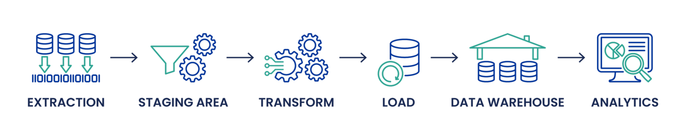

# DATA-WAREHOUSING-ETL-PROJECT

# Data Warehousing : 
Centralised Repository for the purpose of storage , reporting and analysis of data .
- subject-oriented : Focus on business area
- integrated : connect multiple sources of data 
- non volatile 

# ETL (EXTRACT-TRANSFORM-LOAD) : 
 It is a process used to combine data from multiple sources into a large, central repository called a data warehouse.
 The process involves extracting data from different sources, transforming it to fit the target system's requirements, and loading it into the target system.
 
 > A staging area is an intermediate storage location where raw data is temporarily held and processed before being loaded into a data warehouse or database for further analysis.

## ETL v/s ELT
ETL uses the Schema-On-Write approach to transform data before it enters the warehouse. Meanwhile, ELT uses the Schema-On-Read approach to transform data within the data warehouse or lake.
ETL is used for smaller data sets, whereas ELT is used for larger volumes of data, both structured and unstructured.

# Data Architecture 

# Overview 

